## Design Doc: Verified Subscriber System

### Cloud Infra

The subscriber system will be built entirely with AWS. The relevant components are shown below:

```mermaid
---
title: AWS Components
---
flowchart LR
    Amplify[AWS Amplify <br/> <i>CI/CD & Hosting</i>]
    Server[Web Server <br/> <i>Content and Client Behavior</i>]
    Lambda{{AWS Lambda <br/> <i>Subscription Logic</i>}}
    SES[SES <br/> <i>Email Delivery</i>]

    subgraph DynamoDB [DynamoDB]
        DB["<b>Subscribers</b> <br/> 🔑 EmailAddress <br/> 🔹 SubscribedStatus <br/> 🔹 VerifiedStatus <br/> 🔹 VerificationToken"]
    end

    Amplify -- Deploys --> Server
    Amplify -- Provisions --> DB
    Server -- API Request --> Lambda
    Lambda -- API Response --> Server
    Lambda -- Query/Update --> DB
    Lambda -- Emit Email --> SES
    SES -- Verification/Unsubscribe --> Server
```

### Data Schema

A DynamoDB table called Subscribers (provisioned by Amplify) will include these fields:
* EmailAddress (string) (primary key)
* SubscribedStatus (bool) 
* VerificationStatus (bool) 
* VerificationToken (string)
* CreatedAt (datetime) -- when the record was created
* SubscribedAt (datetime) -- the most recent time the user subscribed
* VerifiedAt (datetime) -- the most recent time the user was verified

### User Interface

UI elements in the frontend will allow a user to enter their email into a
"subscribe" text box:

This UI will appear at the top of the main "blog" page and the bottom of each
blog post. Client-side validation will reject improper emails.

### Clicking the Subscribe Button

Entering an email and clicking subscribe will trigger some client behavior that
sends a request to Lambda, to try to verify the subscriber. Lambda will do the
following: 

If Lambda never responds:
* The client will retry once and then tell the user that the server is
  experiencing technical issues and try again later.

If the email address isn't a proper format (server-side validation):
* Lambda will send a response to the client indicating that the email is invalid.
* The client will tell the user that the email is invalid.

If the subscriber already exists in the Subscriber table and they are subscribed: 
* Lambda will send a response back to the client informing that the subsriber
  already exists.
* The client will show the user that they are already subscribed.

If the subscriber does not exist or they are not subscribed (previously
unsubscribed), then they need to be (re-)verified, to prevent someone from
maliciously entering emails other than their own:
* Lambda will generate a unique verification token for the potential subscriber
  and add/overwrite a record in the Subscribers table with their email address,
  verification token, subsribed = False, and Verified = False.
* Lambda will send an email request to SES. The email will include a
  verification link with the new verification token included as a URL
  parameter. The email will inform the user that they should not act if they
  didn't initiate the verification.
* Lambda will send a response to the client and the client will show the user
  that a verification email was sent.

### Clicking the Verification Link

When a user clicks the verification link in their email, they will be routed to
a page on the website. That page will parse the verification token from the URL
and send a request to Lambda. Lambda will scan the Subscribers table and look
for a record that matches the verification token and is unverified. That record
will have VerificationStatus and SubscribedStatus set to True. Then Lambda will
send a response to inform the client that verification was a success, and the
client will tell the user.

If a matching record is not found, no updates will be made. Lambda will send a
response informing the client that no user was found and the client will inform
the user of this.

After verification, if a record was found and updated, Lambda will send a
request to SES to send an email to the user informing them that they are now
verified. This email will include an unsubscribe link which also contains their
verification token.

### Sending Notifications of New Blog Posts

When I upload a new blog post, I will manually trigger a Lambda from the AWS
console that takes the post title and link and emails all the verified
subscribers to inform them about the post. This manual workflow may be enhanced
later. This email will include an unique unsubscribe link for each subscriber,
since the unsubscribe link includes the verification token. This will be
accomplished with SES Templated Emails (SendBulkTemplatedEmail).

### Clicking Unsubscribe Link

When a user clicks the unsubscribe link in their email, it takes them to a page
on my website that works similarly to the verification page. The page parses
out the verification token and sends a request to Lambda, which scans the
Subscribers table for a row with that verification token. If a row is found,
SubscribedStatus will be set to False (VerificationStatus will remain True).
Lambda will send a response to the client that the unsubscription worked.

If a matching record was not found, then Lambda will send a response that the
user was not found and the unsubscription did not work.

### Cleaning the Table

I will create a lambda that flushes out unverified email addresses that are
more than a day old. If someone spams the client with new email addresses and
creates a bunch of unverified subscibers, causing the Subscribers table to get
too big, I will manually activate this lambda from the AWS Console.

### Future Enhancements

1. Rate limiting: preventing spam email addresses by implementing some kind of
   API rate limiting on the new subscriber workflow.
2. Add functionality for rotating out the VerificationToken so that it can't be
   brute force guessed by a malicious actor.
3. Add a secondary index on VerificationToken so that querying the Subscribers
   table for that token will be fast.
4. Use DynamoDB's Time To Live (TTL) feature to automatically delete stale new
   subscriber records, preventing the need for manual flushing.

